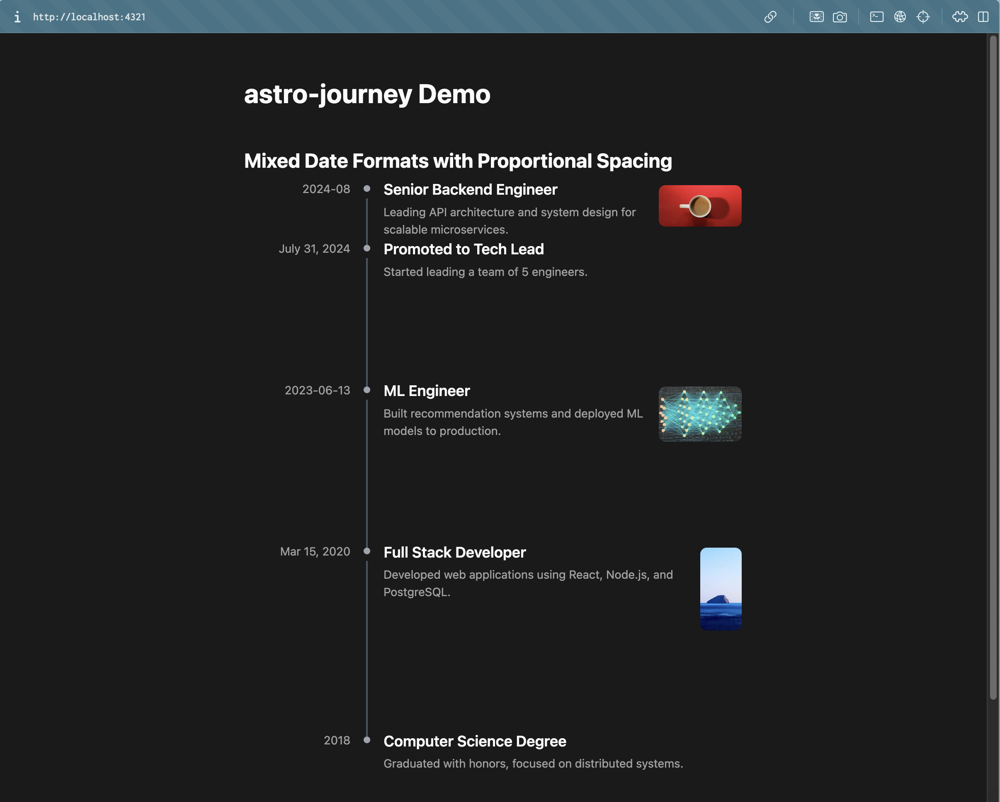

# astro-journey

[](https://www.npmjs.com/package/astro-journey)
[](https://www.npmjs.com/package/astro-journey)
[](https://github.com/uray-lu/astro-journey/blob/master/LICENSE)
[](https://www.typescriptlang.org/)
[](https://astro.build/)

A timeline component for Astro that makes your changelog **intuitive** - entries are spaced based on actual time gaps, so recent changes appear closer together and older ones spread apart.

Supports [multiple date formats](#date-formats) and adapts to any theme. Perfect for portfolios, changelogs, and career journeys.

## Table of Contents

- [Installation](#installation)
- [Quick Start](#quick-start)
- [API Reference](#api-reference)
  - [Date Formats](#date-formats)
  - [Timeline Entry](#timeline-entry)
  - [Timeline Component](#timeline-component)
- [Styling](#styling)
- [Spacing Algorithm](#spacing-algorithm)
- [Versioning](#versioning)
- [Contributing](#contributing)
- [License](#license)

## Installation

```bash
npm install astro-journey
```

## Quick Start



```typescript
---
import Timeline from 'astro-journey/Timeline.astro';
import 'astro-journey/styles.css';

const journeyItems = [
  {
    date: '2024-08',
    title: 'Senior Backend Engineer',
    description: 'Leading API architecture and system design for scalable microservices.',
    link: 'https://example.com/backend',
    image: 'https://picsum.photos/400/200'
  },
  {
    date: 'July 31, 2024',
    title: 'Promoted to Tech Lead',
    description: 'Started leading a team of 5 engineers.'
  },
  {
    date: '2023-06-13',
    title: 'ML Engineer',
    description: 'Built recommendation systems and deployed ML models to production.',
    image: '/machinelearning.jpg'
  },
  {
    date: 'Mar 15, 2020',
    title: 'Full Stack Developer',
    description: 'Developed web applications using React, Node.js, and PostgreSQL.',
    image: 'https://picsum.photos/200/400'
  },
  {
    date: '2018',
    title: 'Computer Science Degree',
    description: 'Graduated with honors, focused on distributed systems.'
  }
];
---

<Timeline items={journeyItems} />
```

> Go to the [demo](./demo) for a complete example.

## API Reference

### Date Formats

Supports multiple formats (newest date first):

| Format | Example |
|--------|---------|
| `YYYY-MM-DD` | `2024-06-15` |
| `YYYY-MM` | `2024-06` |
| `YYYY` | `2024` |
| `MMMM YYYY` | `June 2024` |
| `MMM YYYY` | `Jun 2024` |
| `MMMM D, YYYY` | `June 15, 2024` |
| `MMM D, YYYY` | `Jun 15, 2024` |

> Mix formats freely - the component parses and calculates gaps automatically.

### Timeline Entry

| Prop | Type | Required | Description |
|------|------|----------|-------------|
| `date` | `string` | Yes | Date in supported format |
| `title` | `string` | Yes | Entry title |
| `description` | `string` | No | Entry description |
| `link` | `string` | No | URL (opens in new tab) |
| `image` | `string` | No | Image URL or path |

```typescript
interface TimelineEntry {
  date: string;
  title: string;
  description?: string;
  link?: string;
  image?: string;
}
```

### Timeline Component

| Prop | Type | Default | Description |
|------|------|---------|-------------|
| `items` | `TimelineEntry[]` | `[]` | Array of timeline entries |
| `class` | `string` | - | Additional CSS class |
| `lineColor` | `string` | `#d1d5db` | Connector line color |
| `dotColor` | `string` | `#6b7280` | Dot marker color |
| `titleColor` | `string` | `inherit` | Title text color |
| `titleHover` | `string` | `#3b82f6` | Title hover color |
| `descColor` | `string` | `inherit` | Description text color |
| `dateColor` | `string` | `inherit` | Date text color |

Example with custom colors:

```astro
<Timeline
  items={items}
  lineColor="#8b5cf6"
  dotColor="#8b5cf6"
  titleColor="#7c3aed"
  titleHover="#a78bfa"
  descColor="#6b7280"
  dateColor="#9ca3af"
/>
```

## Styling

The component uses CSS custom properties with `--aj-` prefix for easy customization:

| Property | Default | Description |
|----------|---------|-------------|
| `--aj-dot-size` | `8px` | Size of the dot marker |
| `--aj-dot-color` | `#6b7280` | Dot marker color |
| `--aj-line-width` | `2px` | Width of connector line |
| `--aj-line-color` | `#d1d5db` | Connector line color |
| `--aj-spacing` | `1.5rem` | Base spacing unit |
| `--aj-content-gap` | `1rem` | Gap between marker and content |
| `--aj-title-color` | `inherit` | Title text color |
| `--aj-title-hover-color` | `#3b82f6` | Title hover color |
| `--aj-desc-color` | `inherit` | Description text color |
| `--aj-date-color` | `inherit` | Date text color |

Example:

```css
.aj-timeline {
  --aj-dot-size: 10px;
  --aj-dot-color: #8b5cf6;
  --aj-line-width: 3px;
  --aj-line-color: #8b5cf6;
  --aj-title-color: #7c3aed;
  --aj-title-hover-color: #a78bfa;
}
```

## Spacing Algorithm

The timeline calculates spacing based on actual date differences:

- **1 month gap** = ~1rem padding
- **6 month gap** = ~6rem padding
- **Gaps < 1 month** = 0.5rem minimum
- **Gaps > 8 months** = 8rem maximum

This creates a visual representation of time - recent activity clusters together while older entries spread out.

## Versioning

Published versions are tagged as `v*` (e.g., `v0.1.0`, `v0.2.0`). The `master` branch may contain unreleased features.

To see the source code for a specific published version, check the [tags](https://github.com/uray-lu/astro-journey/tags) or [releases](https://github.com/uray-lu/astro-journey/releases).

## Contributing

Contributions are welcome! Here's how to get started:

1. **Fork the repository**

2. **Clone and install**
   ```bash
   git clone https://github.com/uray-lu/astro-journey.git
   cd astro-journey
   npm install
   ```

3. **Create a feature branch**
   ```bash
   git checkout -b feat/your-feature
   ```

4. **Make your changes**
   - Run tests: `npm test`
   - Run build: `npm run build`
   - **Verify demo works**: `cd demo && npm install && npm run dev`
   - Make sure the demo runs without errors before submitting

5. **Commit and push**
   ```bash
   git commit -m "feat: your feature description"
   git push origin feat/your-feature
   ```

6. **Open a Pull Request**
   - PRs require passing CI checks
   - PRs require review before merging
   - After opening PR, contact me via by the email on my [profile](https://github.com/uray-lu) for review

## License

MIT
